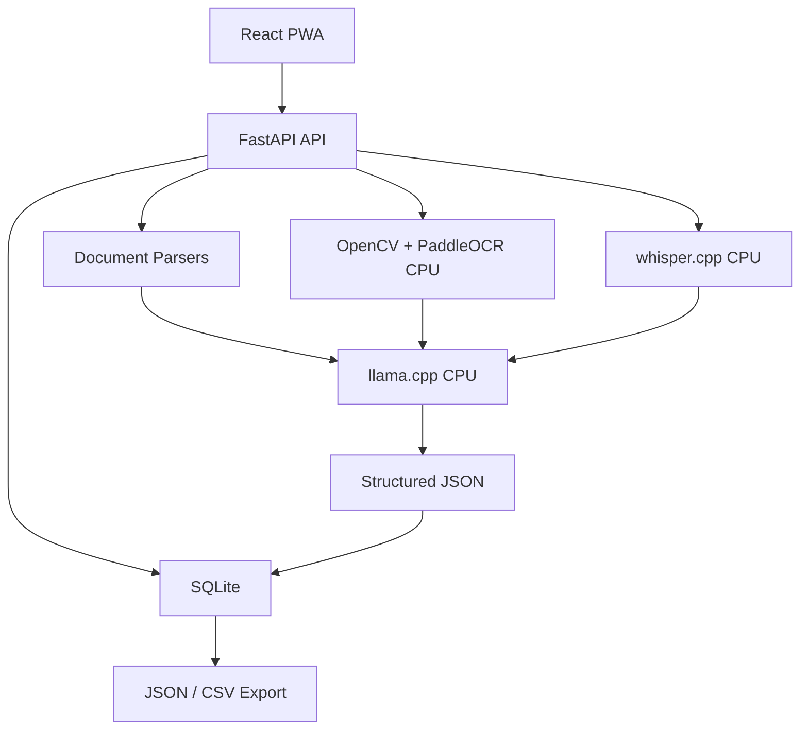

# Architecture

## Backend Layers

- `api`: FastAPI routes
- `models`: SQLAlchemy tables
- `schemas`: Pydantic contracts
- `services`: parser, OCR, audio, local LLM, processor, exporter
- `core`: environment configuration

## Database Tables

- `files`
- `processed_data`
- `history`
- `settings`
